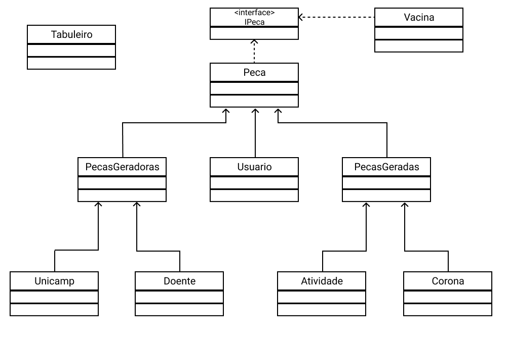

# Projeto EaD Corona Run

# Equipe
* Vitor Rodrigues Pietrobom - 245584
* Guilherme Tezoli Bakaukas - 217332

# Descrição Resumida do Projeto
O projeto consiste num jogo feito em espaco celular que foi baseado no período atual de pandemia e EaD.

O jogo tem como personagens um jogador, o qual pode selecionar seu visual baseado nos criadores do jogo (tendo como opção jogar como Vitor ou como Guilherme) e dois antagonistas, a Unicamp e o Contaminado com Covid-19, sendo que a primeira tem a chance de soltar atividades e o segundo chance de soltar porções do virus.

Explicando agora mais sobre os Debuffs, neste jogo existem dois: Atividades e Vírus. As atividades tem como efeito deixar o jogador inabilitado de realizar movimentos por uma certa quantidade de tempo, já que este tem de concluir a tarefa. Já o vírus é mais extremo, caso o jogador colída com ele o esta morrerá instantaneamente, gerando o Game Over. os dois debuffs só se movem na direção na qual foram gerados e em apenas um sentido, caso colidam com uma parede apenas desaparecem.

O objetivo do jogador no jogo é coletar as vacinas que apareceram aleatóriamente no tabuleiro, ganhando assim um ponto para cada coletada.

Existem quatro dificuldades dentro do jogo: Fácil, Médio, Difícil e Insano. As dificuldades alteram dois parametros: velocidade do jogo e chance de geração de Debuffs.

## Vídeo da Prévia

## Vídeo do Jogo

# Slides do Projeto

## Slides da Prévia
`<Coloque um link para os slides da prévia do projeto.>`

## Slides da Apresentação Final
`<Coloque um link para os slides da apresentação final do projeto.>`

## Relatório de Evolução

> <Relatório de evolução, descrevendo as evoluções do design do projeto, dificuldades enfrentadas, mudanças de rumo, melhorias e lições aprendidas. Referências aos diagramas e recortes de mudanças são bem-vindos.>

# Destaques de Código

> <Escolha trechos relevantes e/ou de destaque do seu código. Apresente um recorte (você pode usar reticências para remover partes menos importantes). Veja como foi usado o highlight de Java para o código.>

~~~java
// Recorte do seu código
public void algoInteressante(…) {
   …
   trechoInteressante = 100;
}
~~~

# Destaques de Pattern
`<Destaque de patterns adotados pela equipe. Sugestão de estrutura:>`

## Diagrama do Pattern
`<Diagrama do pattern dentro do contexto da aplicação.>`

## Código do Pattern
~~~java
// Recorte do código do pattern seguindo as mesmas diretrizes de outros destaques
public void algoInteressante(…) {
   …
   trechoInteressante = 100;
}
~~~

> <Explicação de como o pattern foi adotado e quais suas vantagens, referenciando o diagrama.>

# Conclusões e Trabalhos Futuros

> <Apresente aqui as conclusões do projeto e propostas de trabalho futuro. Esta é a oportunidade em que você pode indicar melhorias no projeto a partir de lições aprendidas e conhecimentos adquiridos durante a realização do projeto, mas que não puderam ser implementadas por questões de tempo. Por exemplo, há design patterns aprendidos no final do curso que provavelmente não puderam ser implementados no jogo -- este é o espaço onde você pode apresentar como aplicaria o pattern no futuro para melhorar o jogo.>

# Documentação dos Componentes

# Diagramas

## Diagrama Geral do Projeto

> <Faça uma breve descrição do diagrama.>

## Diagrama Geral de Componentes

### Exemplo 1

Este é o diagrama compondo componentes para análise:

### Exemplo 2

Este é um diagrama inicial do projeto de jogos:

### Exemplo 3

Este é outro diagrama de um projeto de vendas:

Para cada componente será apresentado um documento conforme o modelo a seguir:

## Componente `<Nome do Componente>`

> <Resumo do papel do componente e serviços que ele oferece.>

**Ficha Técnica**
item | detalhamento
----- | -----
Classe | `<caminho completo da classe com pacotes>`   Exemplo: `pt.c08componentes.s20catalog.s10ds.DataSetComponent`
Autores | `<nome dos membros que criaram o componente>`
Interfaces | `<listagem das interfaces do componente>`

### Interfaces

Interfaces associadas a esse componente:

Interface agregadora do componente em Java:

~~~java
public interface IDataSet extends ITableProducer, IDataSetProperties {
}
~~~

# Componente Tabuleiro

## Interfaces

Interfaces associadas a esse componente:

Campo | Valor
----- | -----
Classe | `Game_project.src.game.Tabuleiro`
Autores | Vitor e Guilherme
Objetivo | Gerir as peças e seus movimentos
Interface | -

# Componente Usuario

## Interfaces

Interfaces associadas a esse componente:

Campo | Valor
----- | -----
Classe | `Game_project.src.game.Usuario`
Autores | Vitor e Guilherme
Objetivo | Representar o Jogador
Interface | IPeca

# Componente Vacina

## Interfaces

Interfaces associadas a esse componente:

Campo | Valor
----- | -----
Classe | `Game_project.src.game.Vacina`
Autores | Vitor e Guilherme
Objetivo | Representar a Vacina
Interface | IPeca

# Componente Corona

## Interfaces

Interfaces associadas a esse componente:

Campo | Valor
----- | -----
Classe | `Game_project.src.game.Corona`
Autores | Vitor e Guilherme
Objetivo | Representar o Corona
Interface | IPeca

# Componente Doente

## Interfaces

Interfaces associadas a esse componente:

Campo | Valor
----- | -----
Classe | `Game_project.src.game.Doente`
Autores | Vitor e Guilherme
Objetivo | Representar o Doente
Interface | IPeca

# Componente Atividade

## Interfaces

Interfaces associadas a esse componente:

Campo | Valor
----- | -----
Classe | `Game_project.src.game.Atividade`
Autores | Vitor e Guilherme
Objetivo | Representar a Atividade
Interface | IPeca

# Componente Unicamp

## Interfaces

Interfaces associadas a esse componente:

Campo | Valor
----- | -----
Classe |`Game_project.src.game.Unicamp`
Autores | Vitor e Guilherme
Objetivo | Representar a Unicamp
Interface | IPeca

## Detalhamento das Interfaces

### Interface `IPeca`

Interface provida por qualquer peça contida no jogo, incluindo o jogador, os personagens, os debuffs e a vacina.

~~~java
public interface IPeca {
	public char getname();
	public boolean getmoved();
	public void move();
	public void setmoved(boolean b);
	public void vinculate_tabuleiro(Tabuleiro tab);
}
~~~

Método | Objetivo
-------| --------
`getname` | Retorna o identificador da peça
`getmoved` | Retorna o status de movimento da peça, podendo está ter se mexido ou não
`move` | Realiza a movimentação da peça
`setmoved` | Define seu status de movimentação
`vinculate_tabuleiro` | Vincula o tabuleiro ao componente para realizar as mudanças de movimentação

# Plano de Exceções

## Diagrama da hierarquia de exceções

## Descrição das classes de exceção

Classe | Descrição
----- | -----
MovimentoInvalido | Engloba todos os movimentos invalidos
SairTabuleiro | Indica que o movimento causaria a saída do tabuleiro
ColisaoInvalida | Engloba todas as colisões invalidas
ColisaoJogador | Indica colisão inválida do jogador com um personagem

