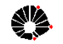
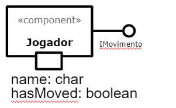

# Projeto EaD Corona Run

# Equipe
* Vitor Rodrigues Pietrobom - 245584
* Guilherme Tezoli Bakaukas - 217332

# Descrição Resumida do Projeto
O projeto consiste num jogo feito em espaco celular que foi baseado no período atual de pandemia e EaD.

O jogo tem como personagens um jogador, o qual pode selecionar seu visual baseado nos criadores do jogo (tendo como opção jogar como Vitor ou como Guilherme) e dois antagonistas, a Unicamp e o Contaminado com Covid-19, sendo que a primeira tem a chance de soltar atividades e o segundo chance de soltar porções do virus.

Explicando agora mais sobre os Debuffs, neste jogo existem dois: Atividades e Vírus. As atividades tem como efeito deixar o jogador inabilitado de realizar movimentos por uma certa quantidade de tempo, já que este tem de concluir a tarefa. Já o vírus é mais extremo, caso o jogador colída com ele o esta morrerá instantaneamente, gerando o Game Over. os dois debuffs só se movem na direção na qual foram gerados e em apenas um sentido, caso colidam com uma parede apenas desaparecem.

O objetivo do jogador no jogo é coletar as vacinas que apareceram aleatóriamente no tabuleiro, ganhando assim um ponto para cada coletada.

Existem quatro dificuldades dentro do jogo: Fácil, Médio, Difícil e Insano. As dificuldades alteram dois parametros: velocidade do jogo e chance de geração de Debuffs.

## Vídeo da Prévia

## Vídeo do Jogo

# Slides do Projeto

## Slides da Prévia
`<Coloque um link para os slides da prévia do projeto.>`

## Slides da Apresentação Final
`<Coloque um link para os slides da apresentação final do projeto.>`

## Relatório de Evolução

> <Relatório de evolução, descrevendo as evoluções do design do projeto, dificuldades enfrentadas, mudanças de rumo, melhorias e lições aprendidas. Referências aos diagramas e recortes de mudanças são bem-vindos.>

* Depois de algumas iterações sobre o projeto percebemos que um jogo baseado em turnos não faria sentido, portanto, optamos por fazer um jogo mais fluido, na qual as peças se movimentam sem ordem fixa definida entre jogador e personagens.

* Tinhamos cogitado a possibilidade de que quando um jogador colidisse com o corona, este teria uma chance de sobreviver, chance esta que também seria afetada pela quantidade de vacinas coletadas, mas acabamos abandonando a ideia pois chegamos a conclusão de que deixaria o jogo mais fácil e imprevisível.

* Na primeira versão do jogo, as peças geradoras podiam gerar uma peça e andar ao mesmo tempo, o que ficava confuso e feio visualmente, então alteramos para que uma peça ande e depois verifique se pode gerar outra, mas nunca os dois ao mesmo tempo.
~~~java
public void move() {	
	if(this.moved==false) {
		super.move();
	}
	else { //caso ja tenha movido ele deve verificar a geração de atividades
		this.verifica_atividade();
	}	
}
~~~

* 

* Alteramos todas as artes do jogo para artes originais e que seguissem um estilo pixelado, criando uma uniformidade entre o jogo inteiro.

* Decidimos criar a possibilidade do jogador escolher seu personagem, tendo como opções os membros do grupo.
 

* Adicionamos uma tela inicial contendo regras do jogo, seguida por uma tela de seleção de personagem.

* Adicionamos uma tela final que permite tentar novamente, sendo que esta tem o gif do meme do caixão, algo que esteve muito em moda neste momento do mundo e combinava com o jogo:

* Após algumas divergências sobre o quão difícil deveria ser o jogo, acabamos por criar quatro dificuldades para o jogo, as quais foram facilmente implementadas pela simplicidade dos parametros:
~~~java
else if (e.getSource()==insane) {
	this.seconds=100; //segundos do timer (100ms para cada rodada do tabuleiro)
	this.probabilidade=95;//probabilidade de gerar corona e atividade
	dificuldade_defined=true;
}
~~~
* Decidimos tambem por alterar as cores dos botões quando selecionados para facilitar o entendimento, algo que so custou duas linhas de codigo em cada dificuldade:
~~~java
else if (e.getSource()==insane) {
	setcolors_dificuldade();//reseta os botões para cinza
	insane.setBackground(Color.green);//botão selecionado fica verde
	this.seconds=100; //segundos do timer (100ms para cada rodada do tabuleiro)
	this.probabilidade=95;//probabilidade de gerar corona e atividade
	dificuldade_defined=true;
}
~~~

* Adicionamos uma nova arte para quando o jogador está afetado pela atividade, uma vez que antes não era possível saber quando o debuff tinha se encerrado.

 

# Destaques de Código

> <Escolha trechos relevantes e/ou de destaque do seu código. Apresente um recorte (você pode usar reticências para remover partes menos importantes). Veja como foi usado o highlight de Java para o código.>
* Dividimos o jogo em rodadas e utilizamos um timer para definir o tempo entre estas rodadas
~~~java
public void start() {//inicia a movimentação automática das peças do tabuleiro
	timer=new Timer(this.seconds,this);
	timer.start();
		
}
~~~
* A variavel seconds utilizada pelo timer é definida pela dificuldade escolhida:
~~~java
else if (e.getSource()==insane) {
	...
	this.seconds=100;//segundos do timer (100ms para cada rodada do tabuleiro)
	...
}
else if (e.getSource()==hard) {
	...
	this.seconds=250;//segundos do timer (250ms para cada rodada do tabuleiro)
	...
}
else if (e.getSource()==medium) {
	...
	this.seconds=500;//segundos do timer (500ms para cada rodada do tabuleiro)
	...
}
else if (e.getSource()==easy) {
	...
	this.seconds=1000;//segundos do timer (1000ms para cada rodada do tabuleiro)
	...
}
~~~
* Quando o jogador morre paramos o timer
~~~java
public void die() {//para o timer no momento da morte do usuario
		timer.stop();
		janela.stop();
}
~~~

* Usamos bastante aleatoriedade no jogo, os códigos abaixo são utilizados para realizar a geração dos coronas e das atividades 
~~~java
private void verifica_atividade() {
		int num=new Random().nextInt(100 + 1);
		if (num<=this.probabilidade) {//chance de criar atividade
			this.create_atividade();
		}	
}
~~~
~~~java
private void verifica_corona() {
		int num=new Random().nextInt(100 + 1);
		if (num<=this.probabilidade) {//chance de 30% de criar corona
			this.create_corona();
		}	
}
~~~
* Já este, também utilizando a aleatoriedade, é utilizado para controlar a geração das vacinas no tabuleiro, as quais aparecem sempre em um lugar aleatório e vazio
~~~java
public void move() {
	while(true) {
		random_linha=new Random().nextInt(tab.linha);
		random_coluna=new Random().nextInt(tab.coluna);
		if (tabuleiro[random_linha][random_coluna]==null) {//encontramos uma espaço vazio aleatorio e colocamos a vacina
			tabuleiro[random_linha][random_coluna]=this;
			this.linha=random_linha;
			this.coluna=random_coluna;
			break;
		}
	}

}
~~~

# Destaques de Pattern
`<Destaque de patterns adotados pela equipe. Sugestão de estrutura:>`

## Diagrama do Pattern
`<Diagrama do pattern dentro do contexto da aplicação.>`

## Código do Pattern
~~~java
// Recorte do código do pattern seguindo as mesmas diretrizes de outros destaques
public void algoInteressante(…) {
   …
   trechoInteressante = 100;
}
~~~

> <Explicação de como o pattern foi adotado e quais suas vantagens, referenciando o diagrama.>

# Conclusões e Trabalhos Futuros

> <Apresente aqui as conclusões do projeto e propostas de trabalho futuro. Esta é a oportunidade em que você pode indicar melhorias no projeto a partir de lições aprendidas e conhecimentos adquiridos durante a realização do projeto, mas que não puderam ser implementadas por questões de tempo. Por exemplo, há design patterns aprendidos no final do curso que provavelmente não puderam ser implementados no jogo -- este é o espaço onde você pode apresentar como aplicaria o pattern no futuro para melhorar o jogo.>

Em conclusão, concordamos que o jogo acabou por ser bem divertido e desafiador quando se olha para as dificuldades mais avançadas. 

Aprendemos muito durante o desenvolvimento do projeto, e isso trouxe consigo inúmeras ideias para melhorias possíveis:
* Aplicar melhor os conceitos de interface, algo que usamos de forma simples e que talvez poderiamos ter explorado melhor
* Melhorar a organização dos pacotes, sub-dividindo mais o pacote principal e separando mais as coisas
* Dividir e organizar mais as coisas relacionadas com a interface gráfica, percebemos no final do projeto que juntar tudo num unico arquivo deixa as coisas bem confusas
* Implementar controles utilizando o teclado, já que o desempenho do jogador caí muito por ter que apertar nos botões pelo mouse
* Melhorar o método de movimentação das peças geradoras, uma vez que agora elas simplesmente se movem aleatóriamente e as vezes não geram um desafio
* Deixar o menu inicial de seleção mais bonito, algo que ficamos sem tempo de fazer e optamos por sua funcionalidade
* Adicionar possíveis buffs para o jogador coletar pelo mapa, como por exemplo alcool em gel que daría um escudo para o jogador.
* Aplicar de fato Design Patterns mais bem definidos, uma vez que nós já tinhamos programado grande parte do jogo quando a aula disso foi lançada, não tivemos a chance de aplicar mais eficazmente esses conceitos
	
	

# Documentação dos Componentes

# Diagramas

## Diagrama Geral do Projeto

> <Faça uma breve descrição do diagrama.>

## Diagrama Geral de Componentes

### Exemplo 1

Este é o diagrama compondo componentes para análise:

### Exemplo 2

Este é um diagrama inicial do projeto de jogos:

### Exemplo 3

Este é outro diagrama de um projeto de vendas:

Para cada componente será apresentado um documento conforme o modelo a seguir:

## Componente `<Nome do Componente>`

> <Resumo do papel do componente e serviços que ele oferece.>

**Ficha Técnica**
item | detalhamento
----- | -----
Classe | `<caminho completo da classe com pacotes>`   Exemplo: `pt.c08componentes.s20catalog.s10ds.DataSetComponent`
Autores | `<nome dos membros que criaram o componente>`
Interfaces | `<listagem das interfaces do componente>`

### Interfaces

Interfaces associadas a esse componente:

Interface agregadora do componente em Java:

~~~java
public interface IDataSet extends ITableProducer, IDataSetProperties {
}
~~~

# Componente Tabuleiro

## Interfaces

Interfaces associadas a esse componente:

Campo | Valor
----- | -----
Classe | `Game_project.src.game.Tabuleiro`
Autores | Vitor e Guilherme
Objetivo | Gerir as peças e seus movimentos
Interface | -

# Componente Usuario

## Interfaces

Interfaces associadas a esse componente:

Campo | Valor
----- | -----
Classe | `Game_project.src.game.Usuario`
Autores | Vitor e Guilherme
Objetivo | Representar o Jogador
Interface | IPeca

# Componente Vacina

## Interfaces

Interfaces associadas a esse componente:

Campo | Valor
----- | -----
Classe | `Game_project.src.game.Vacina`
Autores | Vitor e Guilherme
Objetivo | Representar a Vacina
Interface | IPeca

# Componente Corona

## Interfaces

Interfaces associadas a esse componente:

Campo | Valor
----- | -----
Classe | `Game_project.src.game.Corona`
Autores | Vitor e Guilherme
Objetivo | Representar o Corona
Interface | IPeca

# Componente Doente

## Interfaces

Interfaces associadas a esse componente:

Campo | Valor
----- | -----
Classe | `Game_project.src.game.Doente`
Autores | Vitor e Guilherme
Objetivo | Representar o Doente
Interface | IPeca

# Componente Atividade

## Interfaces

Interfaces associadas a esse componente:

Campo | Valor
----- | -----
Classe | `Game_project.src.game.Atividade`
Autores | Vitor e Guilherme
Objetivo | Representar a Atividade
Interface | IPeca

# Componente Unicamp

## Interfaces

Interfaces associadas a esse componente:

Campo | Valor
----- | -----
Classe |`Game_project.src.game.Unicamp`
Autores | Vitor e Guilherme
Objetivo | Representar a Unicamp
Interface | IPeca

## Detalhamento das Interfaces

### Interface `IPeca`

Interface provida por qualquer peça contida no jogo, incluindo o jogador, os personagens, os debuffs e a vacina.

~~~java
public interface IPeca {
	public char getname();
	public boolean getmoved();
	public void move();
	public void setmoved(boolean b);
	public void vinculate_tabuleiro(Tabuleiro tab);
}
~~~

Método | Objetivo
-------| --------
`getname` | Retorna o identificador da peça
`getmoved` | Retorna o status de movimento da peça, podendo está ter se mexido ou não
`move` | Realiza a movimentação da peça
`setmoved` | Define seu status de movimentação
`vinculate_tabuleiro` | Vincula o tabuleiro ao componente para realizar as mudanças de movimentação

# Plano de Exceções

## Diagrama da hierarquia de exceções

## Descrição das classes de exceção

Classe | Descrição
----- | -----
MovimentoInvalido | Engloba todos os movimentos invalidos
SairTabuleiro | Indica que o movimento causaria a saída do tabuleiro
ColisaoInvalida | Engloba todas as colisões invalidas
ColisaoJogador | Indica colisão inválida do jogador com um personagem

