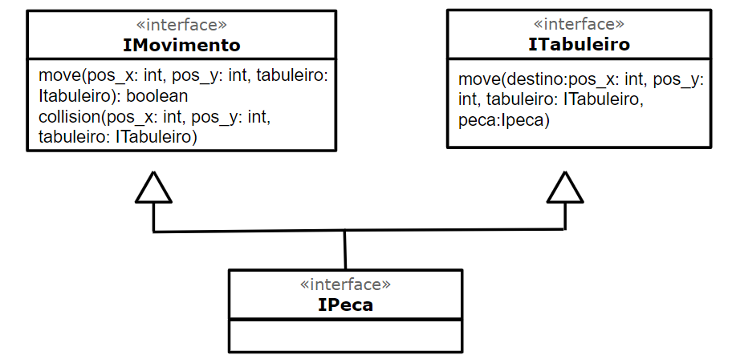

# Projeto EaD Corona Run

# Equipe
* Vitor Rodrigues Pietrobom - 245584
* Guilherme Tezoli Bakaukas - 217332

# Descrição Resumida do Projeto
O projeto consiste num jogo feito em espaco celular baseado em turnos.

O jogo tem como personagens um jogador e dois antagonistas, a Unicamp e um doente, sendo que a primeira solta atividades e o segundo solta corona virus.

A cada turno o jogador pode realizar um movimento e os antagonistas e personagens se movem,

# Vídeo do Projeto

# Diagrama Geral de Componentes

Este é um diagrama inicial do jogo proposto:

Diagrama de herança das interfaces:

Diagrama geral:

Como todos os componentes tem a mesma herança de interfaces, implementando somente IPeca, nao colocamos o diagrama de cada componente separadamente. A classe abstrata Obstaculo terá a função randow_move, herdada pelas subclasses Atividade e Covid-19. A classe abstrata Peca terá as funções randow_move e create, herdadas pelas subclasses Unicamp e Doente.

# Componente Jogador

## Interfaces

Interfaces associadas a esse componente:

Campo | Valor
----- | -----
Classe | Ainda nao criada
Autores | Vitor e Guilherme
Objetivo | Representar o Jogador
Interface | IPeca

# Componente Vacina

## Interfaces

Interfaces associadas a esse componente:

Campo | Valor
----- | -----
Classe | Ainda nao criada
Autores | Vitor e Guilherme
Objetivo | Representar a Vacina
Interface | IPeca

# Componente Covid-19

## Interfaces

Interfaces associadas a esse componente:

Campo | Valor
----- | -----
Classe | Ainda nao criada
Autores | Vitor e Guilherme
Objetivo | Representar o Covid
Interface | IPeca

# Componente Doente

## Interfaces

Interfaces associadas a esse componente:

Campo | Valor
----- | -----
Classe | Ainda nao criada
Autores | Vitor e Guilherme
Objetivo | Representar o Doente
Interface | IPeca

# Componente Atividade

## Interfaces

Interfaces associadas a esse componente:

Campo | Valor
----- | -----
Classe | Ainda nao criada
Autores | Vitor e Guilherme
Objetivo | Representar a Atividade
Interface | IPeca

# Componente Unicamp

## Interfaces

Interfaces associadas a esse componente:

Campo | Valor
----- | -----
Classe | Ainda nao criada
Autores | Vitor e Guilherme
Objetivo | Representar a Unicamp
Interface | IPeca

## Detalhamento das Interfaces

### Interface Imovimento
Analisar o movimento e colisão das peças, determinar se é ou não possível movimentar.

Método | Objetivo
-------| --------
move(pos_x: int, pos_y: int, tabuleiro: Itabuleiro): boolean | Analisar se o movimento é válido. Os parâmetros pos_x e pos_y indicam a posição final da peça, o tabuleiro é passado como parâmetro para ter acesso à matriz em que estão as peças do jogo
collision(pos_x: int, pos_y: int, tabuleiro: ITabuleiro)|Analisar o caso de colisões . Os mesmos parâmetros são passados.

### Interface ITabuleiro

Realizar a movimentação de uma peça. 

Método | Objetivo
-------| --------
move(destino:pos_x: int, pos_y: int, tabuleiro: ITabuleiro, peca:Ipeca) | Realizar a movimentação de uma peça. Os parâmetros são passados para localizar a peça e sua posição final.

